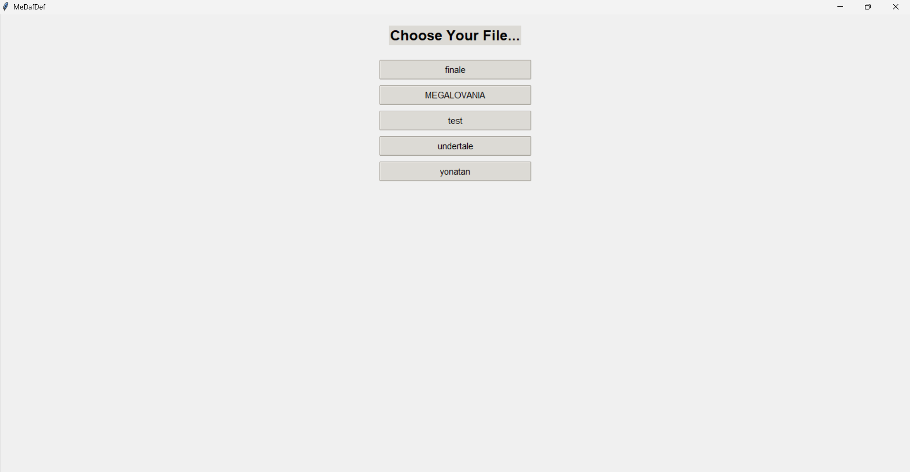
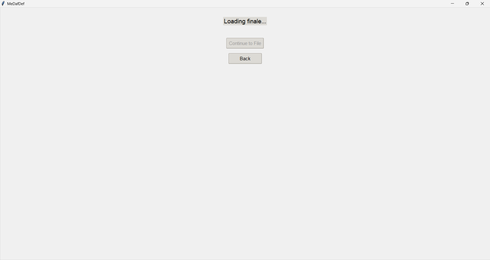
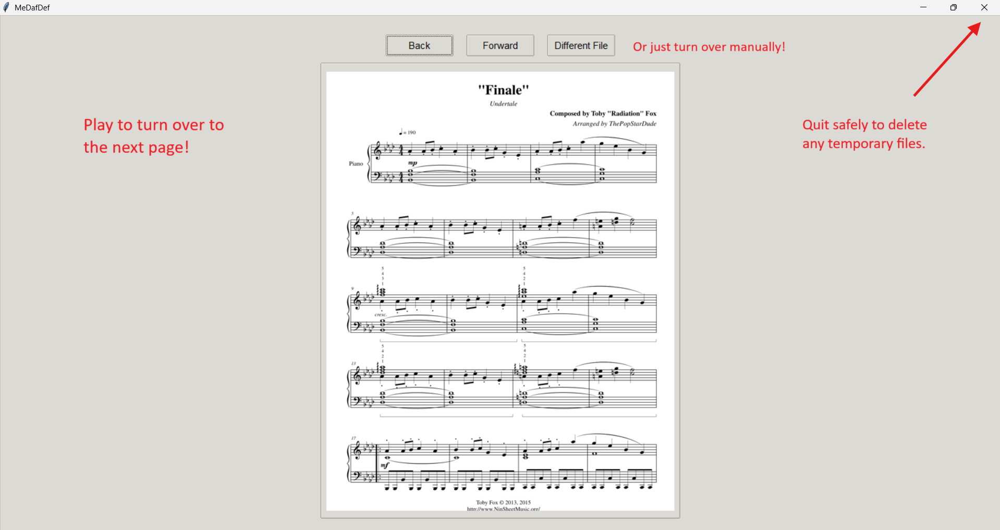
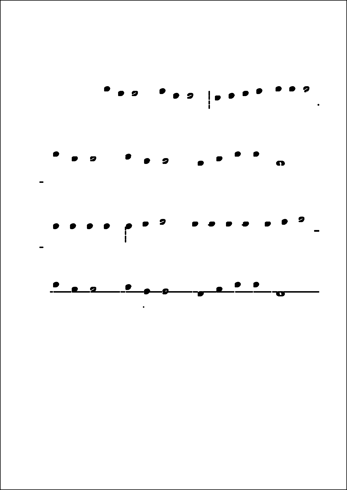
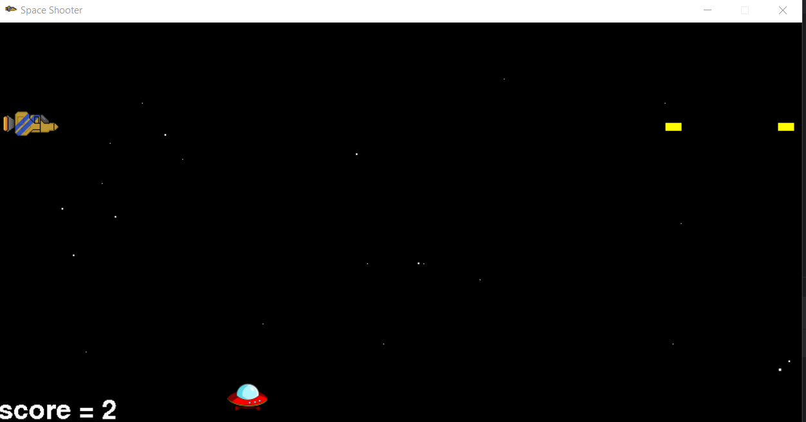

<h1 align="center">Hi 👋, I'm Itay Rimmler</h1>
<h3 align="center">Electrical Engineering Student, ML and Signal Processing Engineer</h3>

- 🔭 I’m currently working on [MeDafDef](https://github.com/ItayRimmler/MeDafDef) and in my free time, [Efroakh](https://github.com/ItayRimmler/Efroakh) and any game I have an idea to create and develop!

- 📫 How to reach me **itay.rimmler@gmail.com**

<h3 align="left">Connect with me:</h3>

<h3 align="left">Languages and Tools:</h3>

---

<h4 align="left">🎼 MeDafDef – Sheet Music Page Turner</h4>

Choose a file, play the music, and pages turn automatically! Developed using Python, audio recognition, and sheet image rendering.

<h3 align="left">Screenshots from my projects:</h3>

<h4 align="left">Prominent Peak Finding Algorithm Made By Integrating C++ and Python, Using Random Forests:</h4>

<h5 align="left">(It also predicted correctly which notes I played on my piano, Fa# and Mi, or F# and E)</h5>

<h4 align="left">Note Isolator From a Previous Version of LiveSheetReader:</h4>

<h4 align="left">One of Many, Many, Video Games I Made:</h4>

